# Folio

> *Pick up where you left off — without re-reading a word.*

Folio is a personal RAG (Retrieval-Augmented Generation) chatbot that lets you query books you've partially read. Drop a PDF into Google Drive, and Folio ingests it, chunks it intelligently by chapter, embeds it, and gives you a conversational interface to ask questions about the content — so you can jump back into any book without losing context.

Built with n8n, OpenAI, and Cohere. No server required.

---

## The Problem

Reading multiple books at once is great until it isn't. When you DNF a book mid-way and come back months later, re-reading earlier chapters just to remember the plot or argument is friction enough to never pick it up again. Folio removes that friction.

---

## Pipeline

```
PDF upload → Google Drive → n8n workflow → Chapter-aware chunker
    → OpenAI embeddings → Vector store → Cohere reranker → n8n chat
```

### Ingestion phase

1. **Drop PDF into Google Drive** — a folder-watch trigger fires the n8n workflow automatically
2. **Chapter-aware chunking** — rather than naive token-count chunking, Folio splits by chapter boundaries first. A metadata flag (`is_chapters_last_page`) marks the final page of each chapter, giving the retriever clean semantic units and reducing cross-chapter hallucination
3. **Oversized chapter handling** — chapters that exceed the token threshold are sub-chunked, but they retain their chapter metadata so the LLM always knows which part of the book a chunk belongs to
4. **Embedding** — chunks are embedded via OpenAI's embedding model and stored in the vector store with their metadata

### Query phase

1. User sends a question via the n8n chat interface
2. Top-k chunks are retrieved from the vector store
3. **Cohere reranker** re-scores retrieved chunks for relevance before passing to the LLM
4. **OpenAI GPT** generates a grounded answer with chapter-level context

---

## Tech Stack

| Layer | Tool |
|---|---|
| Orchestration | n8n |
| Storage trigger | Google Drive |
| Chunking logic | n8n (custom) |
| Embeddings | OpenAI (`text-embedding-ada-002`) |
| Reranking | Cohere Rerank API |
| LLM | OpenAI GPT |
| Chat interface | n8n built-in chat |

---

## Key Design Decisions

**Why chapter-aware chunking?**
Standard chunking by token count splits mid-sentence and ignores narrative structure. Books have natural semantic units — chapters. Chunking at chapter boundaries preserves context and reduces retrieval noise. The `is_chapters_last_page` metadata flag gives the retriever and LLM a clear signal about chunk position within the book's structure.

**Why a reranker on top of vector search?**
Embedding similarity alone doesn't always surface the most contextually relevant chunk. The Cohere reranker adds a second-pass relevance score that significantly improves answer quality, especially for plot or argument continuity questions.

---

## Usage

1. Add a PDF book to your designated Google Drive folder
2. n8n workflow auto-triggers and ingests the book (takes ~1–2 min depending on size)
3. Open the n8n chat interface
4. Ask anything: *"What happened at the end of chapter 3?"*, *"What's the main argument so far?"*, *"Who is Hari Seldon?"*

---

## Notes

- Works best with text-based PDFs (not scanned images)
- Designed for personal use — no multi-user support
- The workflow runs fully within n8n; no additional backend needed
